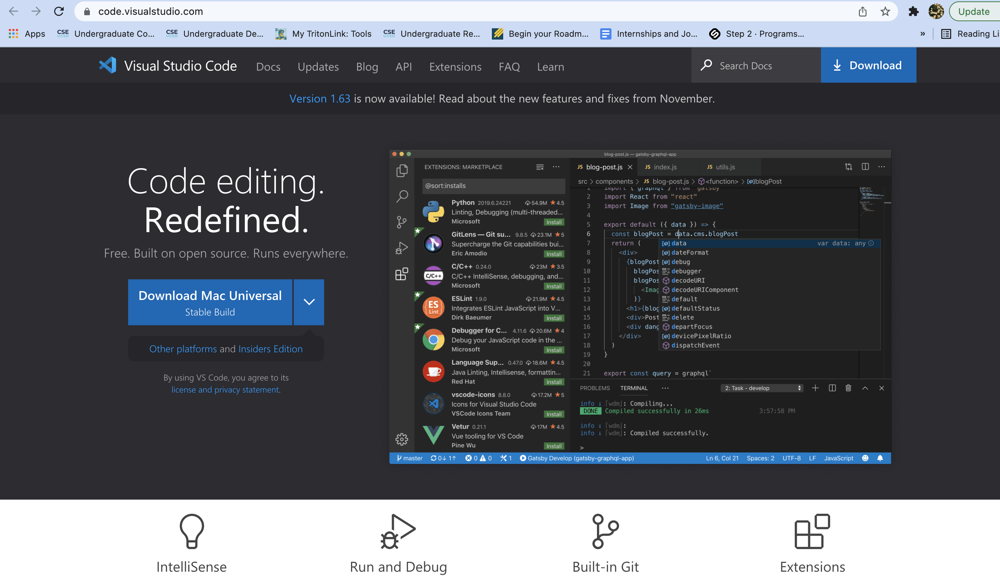
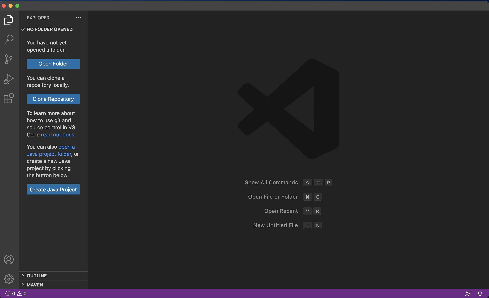
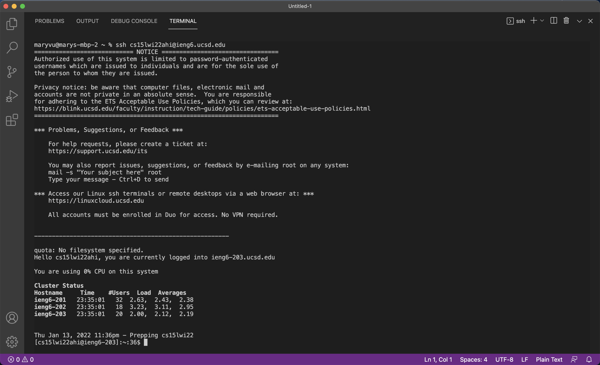
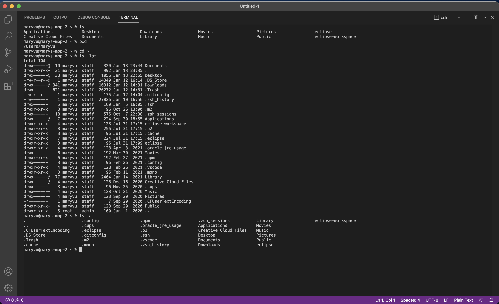
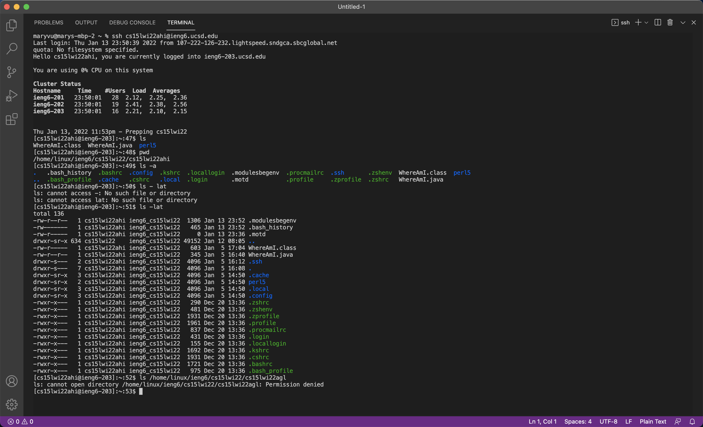

# Mary's First Blog Post: ieng6 Login Tutorial
*  you have at least 6 screenshots, one for each of the steps below
* For each step include 2-3 sentences or bullet points describing what you did.
## Step 1 - Installing  VS Code

* Go to the Visual Studio Code website [here](https://code.visualstudio.com/) 
* Press the blue download button and follow the instructions to install it on your computer
* VS Code should look something like this when you open it

## Step 2 - Remotely Connecting

* Open a terminal in VSCode and enter the following command: 
> ssh cs15lwi22ahi@ieng6.ucsd.edu
* Type yes and then enter your password
## Step 3 - Trying Some Commands
* My computer:

* The remote computer:

## Step 4 - Moving FIles with *scp*
## Step 5 - Setting an SSH Key
## Step 6 - Optimizing Remote Running